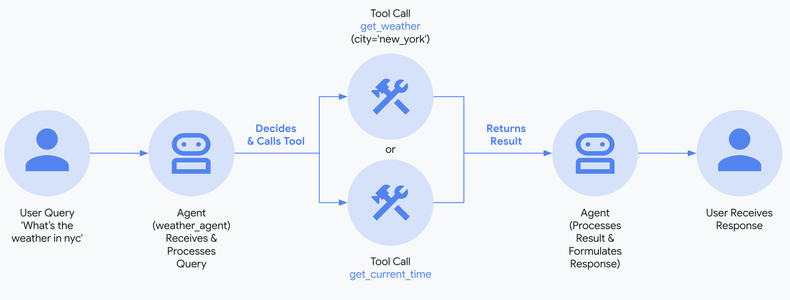

# 🌦️ Weather Agent using Google ADK

This project is a weather agent built using the Google Agent Development Kit (ADK). It enables users to fetch current weather information for any city worldwide by integrating with the OpenWeatherMap APIs.

### 1. Set up Environment & Install ADK

Create & Activate Virtual Environment (Recommended):

```bash
python3 -m venv .venv
source .venv/bin/activate
```

### 2. Install Google ADK:

```bash
pip install google-adk
```

## 🛠️ Usage

### Run the agent locally/web

```bash
adk run weather_agent
adk web
```

### CLI Response

```
[user]: Hows the weather in London?
[weather_agent]: The weather in London is broken clouds, with a temperature of 12.62 degrees Celsius, humidity of 61%, and wind speed of 6.69 m/s.
```


